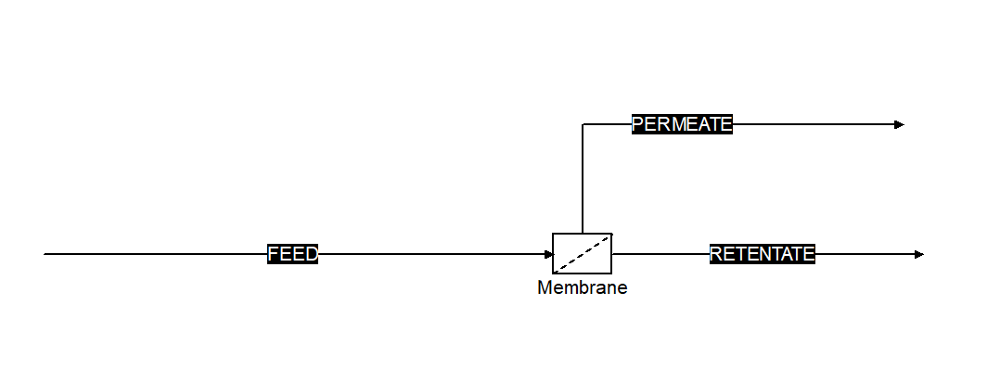

.. _appendix_capeopen:

============================================
Appendix: CAPE-OPEN Interface and COFE Usage
============================================

Component identity
==================

.. list-table::
   :header-rows: 0
   :widths: 26 74

   * - Name
     - ORS Membrane Unit Operation
   * - ProgID
     - ``ORS.MembraneUnitOperation.1``
   * - Category
     - CAPE-OPEN Unit Operation
   * - Runtime
     - .NET Framework 4.8, x64, COM in-process server
   * - Registration
     - per-user (``HKCU``) via ``register-user.ps1`` (no admin)

Ports
=====

.. list-table::
   :header-rows: 1
   :widths: 20 16 64

   * - Port
     - Direction
     - Role
   * - ``Feed``
     - inlet
     - Feed gas stream (sets :math:`T`, :math:`p_\mathrm{r}`, composition, flow)
   * - ``Retentate``
     - outlet
     - Residue at feed pressure :math:`p_\mathrm{r}`
   * - ``Permeate``
     - outlet
     - Product at permeate pressure :math:`p_\mathrm{p}`

Parameters
==========

.. list-table:: Fixed parameters
   :header-rows: 1
   :widths: 26 12 12 14 36

   * - Name
     - Type
     - Unit
     - Mode
     - Meaning
   * - ``PermeatePressure``
     - real
     - Pa
     - input
     - Permeate-side pressure :math:`p_\mathrm{p}`
   * - ``MembraneArea``
     - real
     - m\ :sup:`2`
     - input/output
     - Total area :math:`A` (output in StageCut spec)
   * - ``FlowPattern``
     - option
     - --
     - input
     - ``CrossFlow`` (default) / ``CounterCurrent`` / ``CoCurrent``
   * - ``SpecMode``
     - option
     - --
     - input
     - ``Area`` (rating, default) / ``StageCut`` (design)
   * - ``StageCut``
     - real
     - --
     - output/input
     - Overall stage cut :math:`\theta` (input in StageCut spec)
   * - ``EnergyMode``
     - option
     - --
     - input
     - ``Isothermal`` (default) / ``Adiabatic`` (:ref:`nonisothermal`)
   * - ``DrivingForce``
     - option
     - --
     - input
     - ``Fugacity`` (default, real-gas) / ``PartialPressure`` (ideal) (:ref:`sec-fugacity`)

Per-compound parameters are created dynamically once a feed is connected:

.. list-table:: Dynamic (per-compound) parameters
   :header-rows: 1
   :widths: 40 14 46

   * - Name pattern
     - Unit
     - Meaning
   * - ``Permeance_<id>``
     - mol m\ :sup:`-2` s\ :sup:`-1` Pa\ :sup:`-1`
     - Permeance :math:`Q_i` (input)
   * - ``Profile_Position``
     - --
     - Position :math:`\xi` (0..1), 100 points (array output)
   * - ``Profile_StageCut``
     - --
     - Cumulative :math:`\theta(\xi)` (array output)
   * - ``Profile_Retentate_<id>``
     - --
     - Retentate :math:`x_i(\xi)` (array output)
   * - ``Profile_Permeate_<id>``
     - --
     - Local permeate :math:`y_i(\xi)` (array output)
   * - ``Profile_PermeateCollected_<id>``
     - --
     - Collected (product) permeate :math:`y_i^{\mathrm{coll}}(\xi)` (array output)
   * - ``Profile_RetentateTemperature`` / ``Profile_PermeateTemperature``
     - K
     - Temperature profiles (array output, Adiabatic mode only)

.. note::

   The array (profile) parameters follow the Parameter Common Interface errata
   contract (:ref:`sec-profiles`): ``Type = CAPE_ARRAY`` and the value is a
   ``SAFEARRAY(VARIANT)``. This is what lets COFE plot them; a ``double[]``
   value shows ``<invalid value>`` in the grid instead.

Persistence versions
====================

.. list-table::
   :header-rows: 1
   :widths: 16 84

   * - Version
     - Adds
   * - v1
     - permeate pressure, membrane area, flow pattern, per-compound permeances
   * - v2
     - computed stage cut (survives COFE's solve-instance hop)
   * - v3
     - position / stage-cut / retentate / local-permeate profiles
   * - v4
     - collected-permeate profile
   * - v5
     - spec mode (Area / StageCut)
   * - v6
     - energy mode, outlet temperatures, temperature profiles
   * - v7
     - driving-force mode (fugacity / partial pressure)

COFE usage walkthrough
======================

   The registered unit on a COFE flowsheet, with Feed, Retentate and Permeate
   material streams connected. The icon is set to COFE/JUICE's built-in membrane
   symbol in place of the default square unit-operation box.

#. **Register** the unit (once): run ``register-user.ps1`` from the deployed
   ``bin/x64/Release`` folder.
#. **Place** the unit on the flowsheet and connect a feed material stream to
   ``Feed`` and product streams to ``Retentate`` and ``Permeate``.
#. **Validate / open the unit**: the parameter grid populates with a
   ``Permeance_<id>`` row per feed compound. Enter permeances (see
   :ref:`data_library`), the permeate pressure, and either the membrane area
   (``SpecMode = Area``) or a target stage cut (``SpecMode = StageCut``).
#. **Solve**. The retentate and permeate streams receive their compositions,
   flows, pressures, and (in ``Adiabatic`` mode) temperatures.
#. **Plot** the ``Profile_*`` array parameters with COFE's plotting utility to
   see concentration and temperature profiles along the module.

Worked configuration (CO\ :sub:`2`/CH\ :sub:`4`)
------------------------------------------------

A representative natural-gas sweetening screening point:

.. list-table::
   :header-rows: 0
   :widths: 44 56

   * - Feed
     - 10 % CO\ :sub:`2` / 90 % CH\ :sub:`4`, 40 °C, 60 bar
   * - Permeate pressure
     - 2 bar
   * - Permeances
     - CO\ :sub:`2` :math:`3.0\times10^{-8}`, CH\ :sub:`4` :math:`1.5\times10^{-9}`
       mol m\ :sup:`-2` s\ :sup:`-1` Pa\ :sup:`-1` (ideal selectivity 20)
   * - Membrane area
     - :math:`\approx 25\ \mathrm{m^2}` per mol s\ :sup:`-1` of feed

gives stage cut :math:`\theta \approx 0.31`, a CO\ :sub:`2`-lean retentate
(:math:`\sim0.4\%`) and a CO\ :sub:`2`-rich permeate (:math:`\sim31\%`); in
``Adiabatic`` mode the permeate leaves several kelvin below the feed by
Joule--Thomson expansion (:ref:`nonisothermal`).
