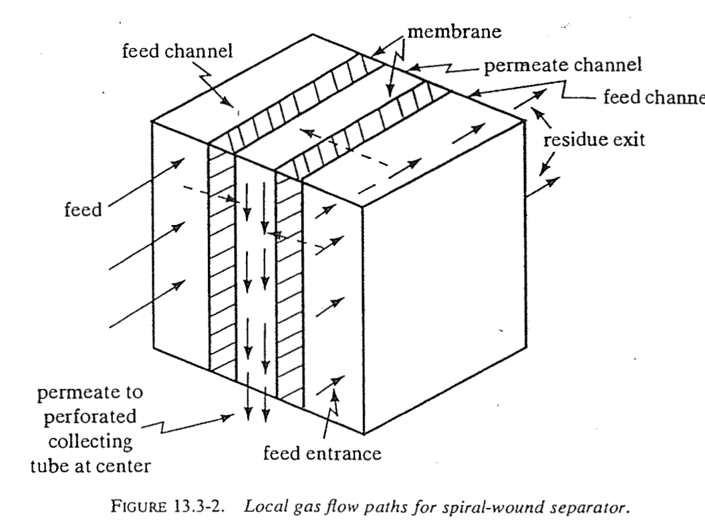
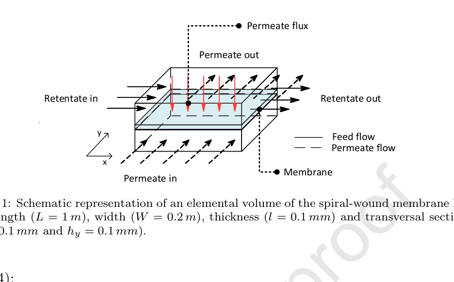

.. _crossflow:

=====================
The Cross-Flow Model
=====================

Physical picture
================

Cross-flow is the default and the realistic idealisation for **spiral-wound**
modules, the dominant industrial geometry for gas separation
:cite:`baker2004,diaspinto2020`. The permeate that forms at a point on the active
layer leaves *normal* to the membrane and is immediately swept into the permeate
channel, so it does **not** mix back with permeate formed elsewhere. Two
consequences follow:

#. The local driving force uses the **local retentate composition**
   :math:`\{x_i(a)\}` on the high-pressure side and the **freshly-formed local
   permeate** :math:`\{y_i(a)\}` on the low-pressure side --- there is no bulk
   permeate composition entering the driving force.
#. The **collected permeate** (the product) is the mixed-cup average of all the
   local permeate produced from the feed end to the retentate outlet; it is
   obtained by an overall balance, not by a driving force.

This is exactly the Weller--Steiner / Shindo cross-flow model
:cite:`weller1950,shindo1985`; the multicomponent, area-resolved form
implemented here follows the spiral-wound treatment of :cite:`diaspinto2020`.

   Local gas flow paths in a spiral-wound element: the feed flows axially in the
   feed channel while permeate crosses the membrane *normal* to the feed and
   flows off in the permeate channel toward the collecting tube. This
   perpendicular sweep is exactly the cross-flow assumption. Reproduced from
   Geankoplis, Fig. 13.3-2.

   Elemental volume of a spiral-wound membrane leaf: retentate flows along
   :math:`x`, permeate is drawn normal to the membrane and off along :math:`y`.
   Reproduced from Dias & Pinto. The unit integrates the
   1-D reduction of this geometry along the retentate path.

Governing equations
===================

Let :math:`R(a)` be the local retentate molar flow and :math:`\{x_i(a)\}` its
composition, with area :math:`a` measured from the feed end. The local permeate
composition :math:`\{y_i\}` is the flux-fraction solution of the local permeate
relationship :eq:`eq-yi-reduced` evaluated at :math:`\{x_i(a)\}`. The component
and total balances :eq:`eq-mass-balance` combine to

.. math::
   :label: eq-cf-area

   \tder{R}{a} = -\,J_\mathrm{tot}(x), \qquad
   R\,\tder{x_i}{a} = \bigl(x_i - y_i\bigr)\,J_\mathrm{tot}(x),

with :math:`J_\mathrm{tot}` from :eq:`eq-total-flux`. A key simplification of the
cross-flow model is obtained by eliminating area in favour of the retentate flow
as the independent variable. Dividing the two equations in :eq:`eq-cf-area`
removes :math:`J_\mathrm{tot}` entirely:

.. math::
   :label: eq-cf-composition

   \boxed{\;\tder{x_i}{R} \;=\; \frac{y_i - x_i}{R}\;}

The composition trajectory :math:`\{x_i(R)\}` therefore depends **only on the
cut**, not on the absolute permeance level, pressures aside from their ratio, or
membrane area. This is the numerically well-behaved core that the solver
integrates. The **area** required to reach a given retentate flow is recovered
by a quadrature that reintroduces the absolute flux,

.. math::
   :label: eq-cf-area-quad

   A \;=\; \int_{R(A)}^{F} \frac{\dd R}{J_\mathrm{tot}\bigl(x(R)\bigr)} ,

and the **stage cut** is :math:`\theta = 1 - R(A)/F` (:eq:`eq-stage-cut`).

Rating vs. design
=================

Equations :eq:`eq-cf-composition`--:eq:`eq-cf-area-quad` support both directions
of the calculation (:ref:`sec-spec-mode`):

* **Rating** (given area): integrate :eq:`eq-cf-composition` in :math:`R`,
  accumulating area with :eq:`eq-cf-area-quad`, and stop when the accumulated
  area reaches the specified :math:`A`. The stage cut is an output.
* **Design** (given stage cut): integrate from :math:`R=F` down to
  :math:`R = F(1-\theta)` for the target :math:`\theta`; the required area is the
  quadrature :eq:`eq-cf-area-quad`. This is implemented as an outer root-find on
  area (:ref:`sec-required-area`).

The collected (product) permeate
================================

At any position the cumulative collected permeate follows from an overall
balance between the feed and the local retentate. If a fraction
:math:`\theta(\xi) = 1 - R(\xi)/F` of the feed has permeated up to position
:math:`\xi`, the collected permeate mole fraction is

.. math::
   :label: eq-collected

   y_i^{\mathrm{coll}}(\xi)
   \;=\; \frac{z_i - x_i(\xi)\,\bigl(1 - \theta(\xi)\bigr)}{\theta(\xi)} ,

which at the module outlet (:math:`\xi = 1`) gives the product permeate
composition. Note the distinction, made explicit in the plotted profiles
(:ref:`sec-profiles`): the **local** permeate :math:`y_i(\xi)` is the composition
of gas crossing the membrane *at* :math:`\xi` (richest in the fast gas near the
feed end, where the retentate is still fast-gas-rich), whereas the **collected**
permeate :math:`y_i^{\mathrm{coll}}(\xi)` is the accumulated product, which is
always less enriched than the local permeate at the feed end because it averages
in the leaner permeate produced downstream.

Validation
==========

The cross-flow model reproduces the Shindo *et al.* cross-flow benchmark tables
:cite:`shindo1985` for a ternary NH\ :sub:`3`/H\ :sub:`2`/N\ :sub:`2` purge-gas
separation to a relative agreement of :math:`\sim 2\times10^{-4}`; the detailed
comparison, including a corrected permeance typographical value in one case, is
given in :ref:`sec-val-shindo`.
