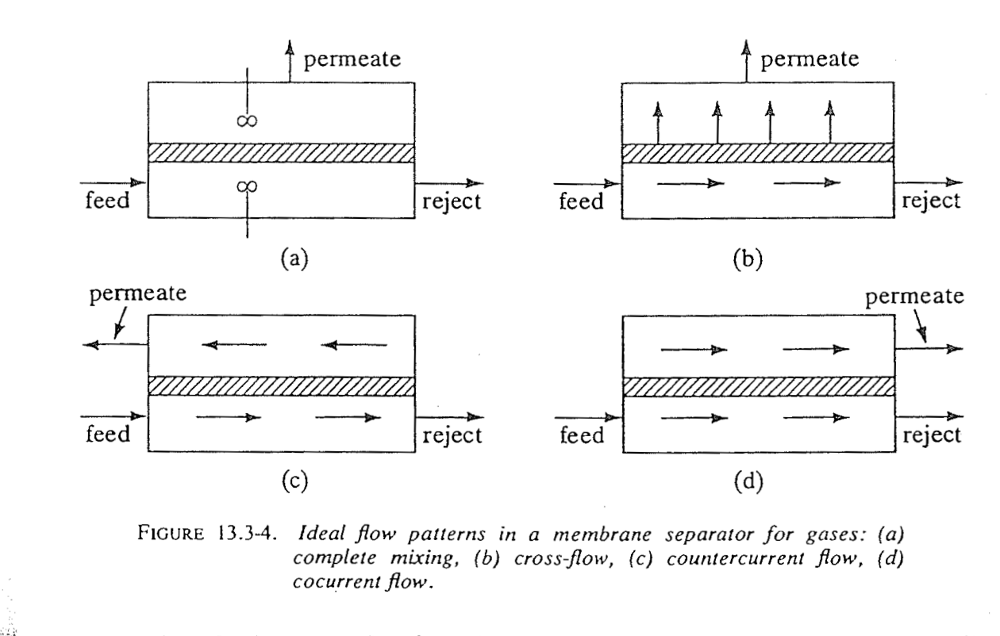
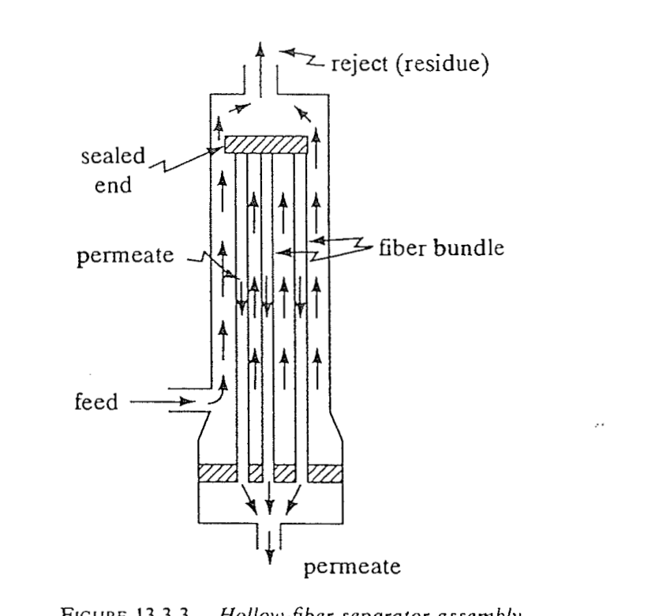

.. _flow_patterns:

===============================
Co-current and Counter-current
===============================

Motivation
==========

Cross-flow (:ref:`crossflow`) is the realistic model for spiral-wound modules.
The **co-current** and **counter-current** patterns are provided as the two
*bounding* idealisations and for geometries (notably hollow-fibre modules with a
well-defined permeate channel) that approach true co- or counter-current
contacting :cite:`shindo1985,pan1986`. In these patterns the permeate flows
*alongside* the feed as a bulk stream, so the driving force uses the **bulk
permeate composition** on the low-pressure side rather than the locally-formed
permeate of cross-flow.

   The ideal flow patterns for a gas-permeation membrane module:
   (a) complete mixing, (b) cross-flow, (c) counter-current, (d) co-current.
   The unit implements (b) as the default and (c)/(d) as the bounding
   idealisations; (a) is shown for reference. Reproduced from Geankoplis,
   Fig. 13.3-4.

Governing equations
===================

With area :math:`a` from the feed end, retentate flow :math:`R(a)`, permeate
flow :math:`V(a)`, and the local flux referred to the *bulk* permeate
composition :math:`y_i`,

.. math::
   :label: eq-fp-flux

   J_i \;=\; Q_i\,\bigl(p_\mathrm{r}\,x_i - p_\mathrm{p}\,y_i\bigr),
   \qquad J_\mathrm{tot} = \sum_k J_k ,

the retentate side obeys, as before,

.. math::
   :label: eq-fp-ret

   \tder{R}{a} = -\,J_\mathrm{tot}, \qquad
   \tder{(R x_i)}{a} = -\,J_i .

The permeate side differs by flow direction:

.. math::
   :label: eq-fp-perm

   \text{co-current:}\quad
   \tder{V}{a} = +\,J_\mathrm{tot}, \;\; \tder{(V y_i)}{a} = +\,J_i,
   \quad V(0)=0 ;
   \\[4pt]
   \text{counter-current:}\quad
   \tder{V}{a} = -\,J_\mathrm{tot}, \;\; \tder{(V y_i)}{a} = -\,J_i,
   \quad V(A)=0 .

**Co-current** is an initial-value problem: retentate and permeate both start at
the feed end (:math:`a=0`), the permeate accumulating from zero, so a single
forward sweep integrates the system.

**Counter-current** is a two-point boundary-value problem: the permeate enters
with zero flow at the retentate outlet (:math:`a=A`) and leaves at the feed end,
so the permeate composition at the feed end is unknown a priori. It is solved by
the iterative cell/BVP scheme of :ref:`sec-counter-bvp`.

   Hollow-fibre module: high-pressure feed on the shell side, permeate collected
   counter-currently inside the fibres. This geometry approaches the
   counter-current idealisation. Reproduced from Geankoplis,
   Fig. 13.3-3.

In both cases the driving force can locally vanish or reverse if the bulk
permeate partial pressure :math:`p_\mathrm{p} y_i` approaches the retentate
partial pressure :math:`p_\mathrm{r} x_i`; the integrator caps the flux at zero
for any component whose driving force would go negative, consistent with a
non-return (one-way) permeation assumption.

Ranking of the patterns
=======================

For the same membrane area, feed, and pressures the three patterns separate in a
fixed order. Counter-current maintains the largest *average* driving force for
the fast component (fresh, lean permeate always faces the leanest retentate), so
it achieves the **highest** stage cut and the sharpest separation; co-current
maintains the smallest (rich permeate meets rich feed early, collapsing the
downstream driving force), giving the **lowest**; cross-flow lies between them
:cite:`shindo1985`:

.. math::
   :label: eq-fp-ranking

   \theta_\mathrm{counter} \;>\; \theta_\mathrm{cross} \;>\; \theta_\mathrm{co}.

The spread is typically modest for the moderate pressure ratios and selectivities
of interest --- a few percent in stage cut --- which is why cross-flow is an
adequate and conservative default for spiral-wound duty, with counter-current
available as the best-case bound (e.g. for hollow-fibre) and co-current as the
worst case.

Choosing a pattern
==================

.. list-table:: Flow-pattern selection guide
   :header-rows: 1
   :widths: 22 26 52

   * - Pattern
     - Best represents
     - Notes
   * - **Cross-flow** (default)
     - Spiral-wound modules
     - Permeate swept normal to the membrane; realistic industrial default.
   * - **Counter-current**
     - Hollow-fibre with counter-current permeate
     - Best-case separation bound; largest stage cut for a given area.
   * - **Co-current**
     - Hollow-fibre / plate-and-frame co-current
     - Worst-case bound; smallest stage cut.

Validation
==========

The counter-current implementation reproduces the Shindo *et al.*
counter-current benchmark :cite:`shindo1985` to within the reported table
precision; see :ref:`sec-val-shindo`.
