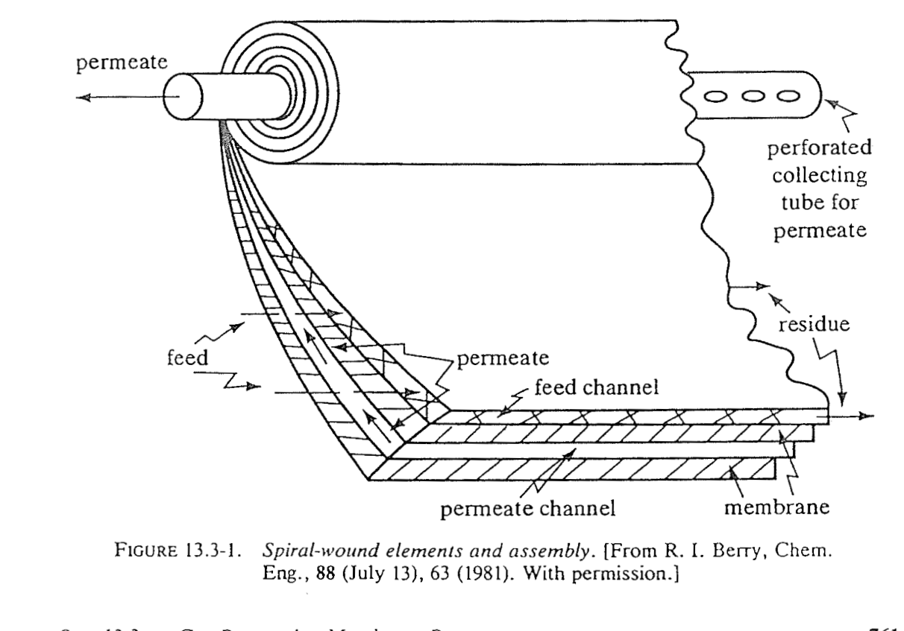

.. _introduction:

============
Introduction
============

Scope
=====

This reference documents the ORS **gas-permeation membrane unit operation**: a
CAPE-OPEN 1.0 compliant unit operation, usable in COFE and other CAPE-OPEN
process modelling environments (PMEs), that models the separation of a
multicomponent gas mixture across a permselective membrane. It covers:

* the **transport physics** (solution--diffusion, partial-pressure driving
  force) and the resulting model equations (:ref:`solution_diffusion`);
* three **flow configurations** --- cross-flow, co-current, and counter-current
  --- and where each is appropriate (:ref:`crossflow`, :ref:`flow_patterns`);
* an optional **adiabatic non-isothermal** layer that assigns outlet
  temperatures and captures Joule--Thomson cooling of the permeate
  (:ref:`nonisothermal`);
* the **numerical solution methods** and the **software architecture** that
  keep the physics independent of the CAPE-OPEN plumbing
  (:ref:`solution_methods`, :ref:`architecture`);
* **validation** against published benchmark tables and against the analytic
  limits of the energy balance (:ref:`validation`); and
* a citable **permeability / permeance data library** for common gas pairs,
  membrane materials, and commercial modules (:ref:`data_library`).

The unit operation
==================

A single membrane module has one inlet and two outlets:

.. only:: html

   .. figure:: figures/tikz_module.png
      :width: 70%
      :align: center

.. only:: latex

   .. raw:: latex

      \begin{center}
      \input{module_body.tex}
      \end{center}

The **fast** components (high permeability) are enriched in the low-pressure
permeate; the **slow** components are enriched in the retentate. The degree of
separation is governed by three levers: the membrane's intrinsic selectivity
(the ratio of permeances), the pressure ratio :math:`\gamma = p_\mathrm{p} /
p_\mathrm{r}`, and the **stage cut** :math:`\theta` (the fraction of the feed
that permeates), which is set by how much membrane area is installed.

   A real spiral-wound element: feed and permeate sheets are wound around a
   central perforated permeate collection tube. The feed flows axially; permeate
   crosses the membrane and spirals inward to the tube. Reproduced from
   Geankoplis, Fig. 13.3-1 (after Berry, *Chem. Eng.* 1981).

The unit exposes, through the PME's parameter grid, per-component permeances,
the permeate pressure, the membrane area (or a target stage cut ---
:ref:`sec-spec-mode`), the flow pattern, and position-dependent concentration
profiles that COFE can plot (:ref:`sec-profiles`).

Why a solution--diffusion cross-flow model
===========================================

Several published membrane models were evaluated before implementation
:cite:`shindo1985,coker1998,geankoplis,dejaco2020,diaspinto2020`. The design
target was a model that is (i) **rigorous enough** to reproduce published
benchmark separations, (ii) **robust** inside a flowsheet solver (no reliance on
initial guesses that a PME cannot provide), (iii) **delegatable** --- all
thermodynamics obtained from the PME's property package rather than re-derived
--- and (iv) **transparent** enough to validate term by term.

The chosen basis is the **solution--diffusion** flux law with a
**partial-pressure driving force**, integrated along the module. The default
flow pattern is **cross-flow**, which is the realistic idealisation for
spiral-wound modules (the dominant industrial geometry for gas separation): the
permeate leaves the active layer normal to the membrane and is swept away, so
the local permeate composition is set by the *local* flux ratio rather than by a
bulk permeate stream :cite:`shindo1985,coker1998`. Co-current and
counter-current are provided as the bounding cases (:ref:`flow_patterns`).

The fuller 1-D spiral-wound permeator of :cite:`dejaco2020`, which couples a
rigorous channel **pressure-drop** model with the real-gas treatment through an
NLP solver, was considered but not adopted wholesale: the pressure-drop part
requires module geometry and a solver that do not fit the CAPE-OPEN
"solve-on-demand" contract. Its **real-gas fugacity** driving force, however, *is*
adopted --- as the default, with the fugacity coefficients delegated to the PME
and evaluated at feed conditions (:ref:`sec-fugacity`). Channel pressure drop
remains a documented future extension (:ref:`sec-limitations`).

.. _sec-limitations:

Assumptions and limitations
===========================

The current model assumes:

* **Constant permeance** per component (no concentration-, pressure-, or
  temperature-dependent permeance; no plasticisation). Permeance is supplied by
  the user or taken from :ref:`data_library`.
* **Negligible feed-channel pressure drop**: the retentate side is at a single
  pressure :math:`p_\mathrm{r}`, the permeate side at :math:`p_\mathrm{p}`.
* A **real-gas fugacity driving force by default** (:math:`\varphi` from the
  PME's equation of state, feed-evaluated and held constant along the module); a
  partial-pressure (ideal-gas) mode is selectable, and the unit falls back to it
  if the property package cannot supply fugacity coefficients. See
  :ref:`sec-fugacity`.
* **Isothermal separation**; temperatures are assigned by the optional adiabatic
  energy layer (:ref:`nonisothermal`), which does not feed back into the
  separation because permeance is taken temperature-independent.
* A **single membrane stage**; multi-stage cascades are built by wiring several
  unit instances in the flowsheet.

These assumptions are standard for screening and conceptual-design duty and are
shared by the benchmark models used for validation :cite:`shindo1985,geankoplis`.
