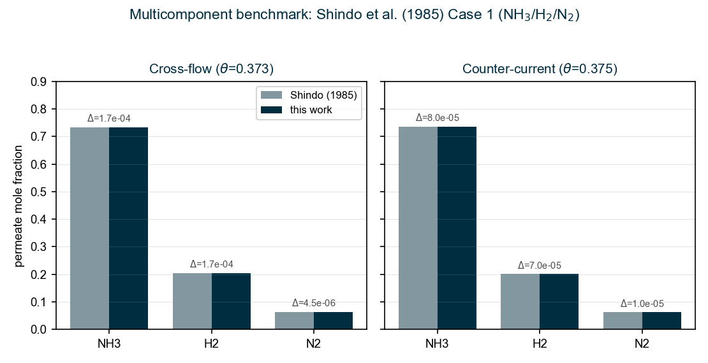
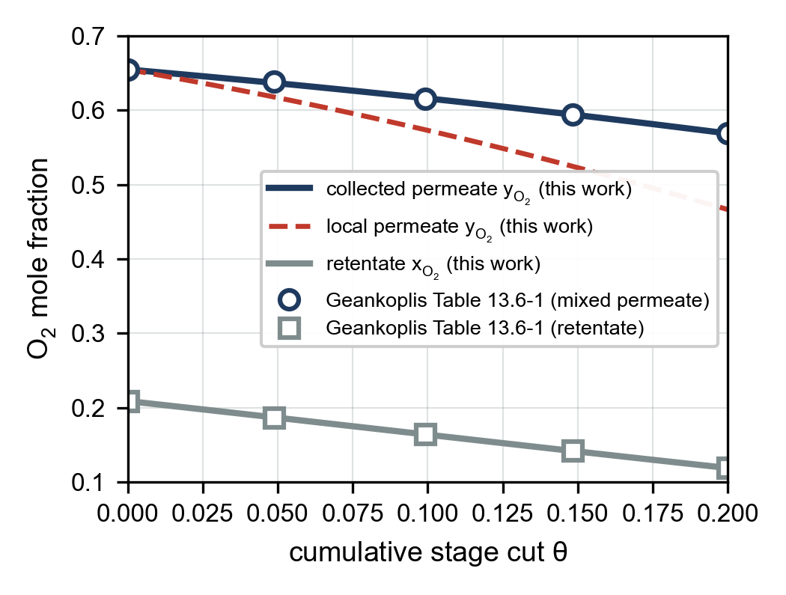
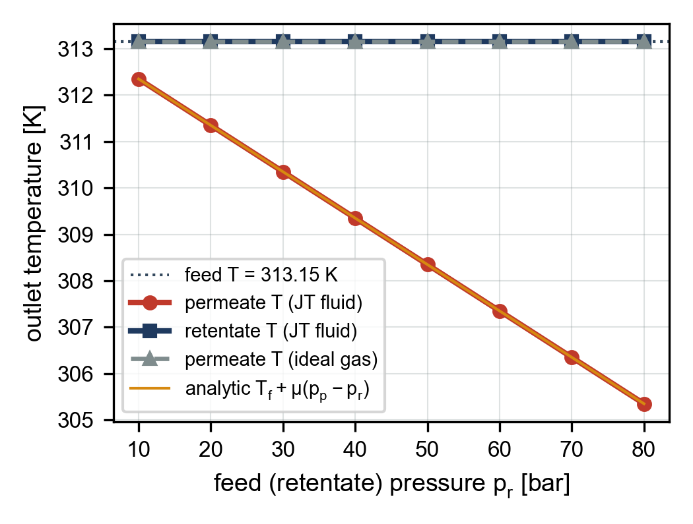
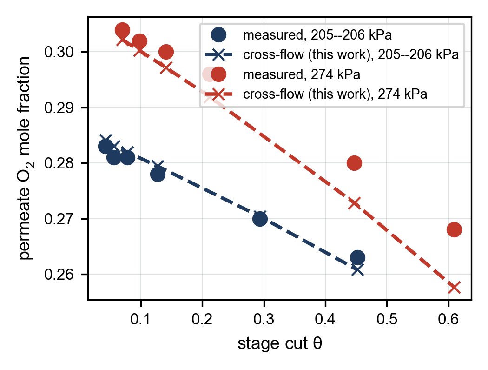
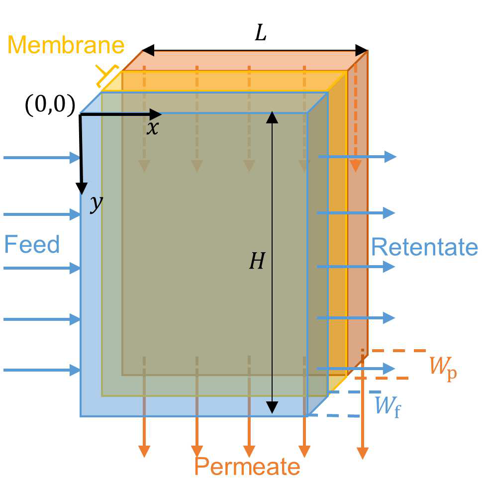
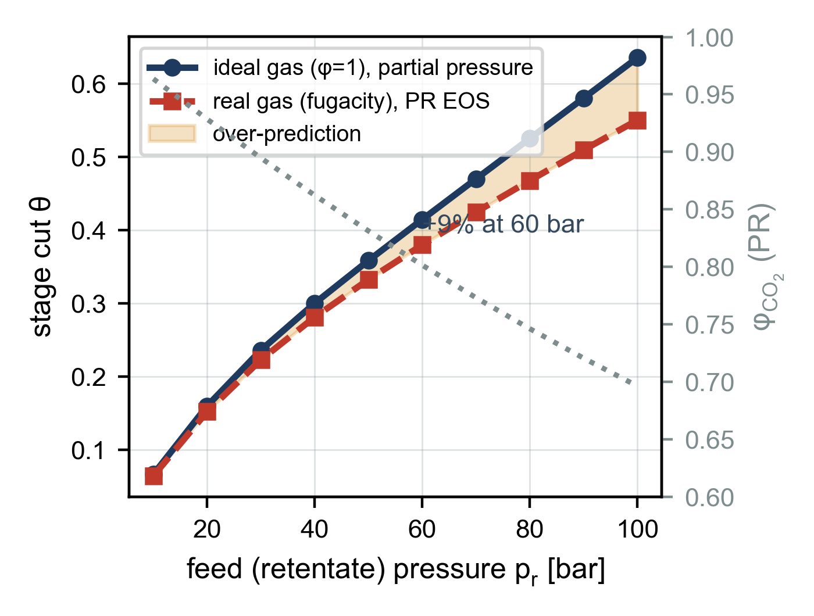
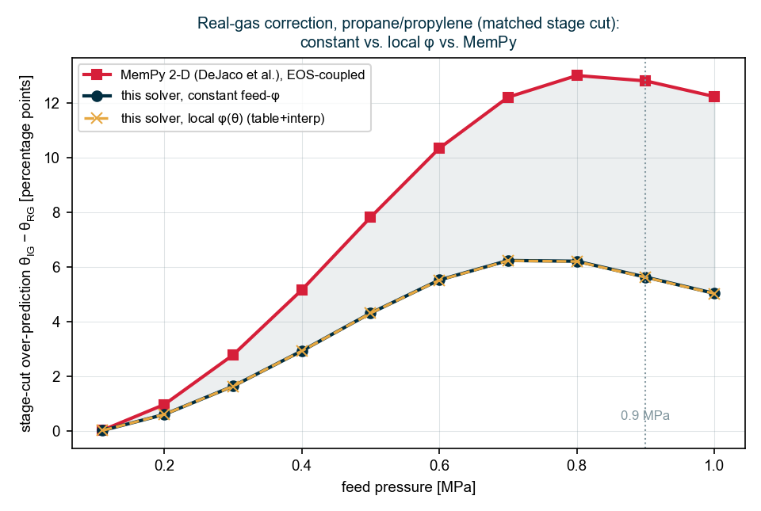
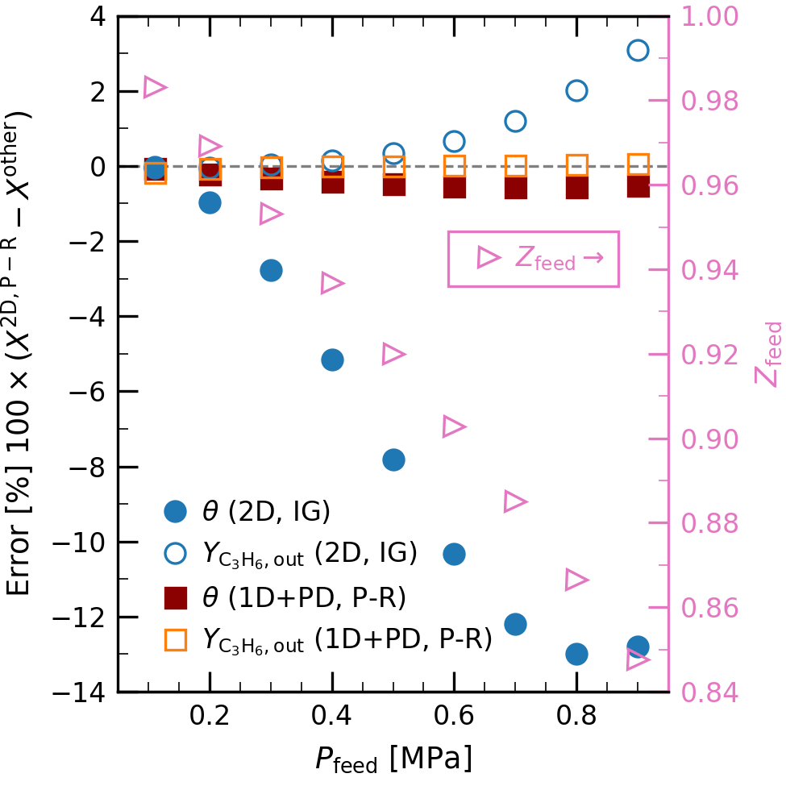

.. _validation:

==========
Validation
==========

The unit is validated at four levels: an automated **unit-test suite** over the
physics core and the adapter; reproduction of two independent **published
benchmark** separations (Shindo/Dias and Geankoplis); the **analytic limits** of
the energy balance; and the **experimental context** for this class of model
from the literature. All figures in this chapter are produced by matplotlib
scripts in ``figures/`` that read CSVs dumped by the actual solver
(``figures/gen``); none of the "this work" numbers are hand-entered.

Automated test suite
====================

46 automated tests run on every build (``dotnet test``):

.. list-table::
   :header-rows: 1
   :widths: 40 12 48

   * - Suite
     - Tests
     - Covers
   * - ``LocalPermeateSolver``
     - 16
     - the singularity-free local permeate root-find (:ref:`sec-local-permeate-solver`), binary and multicomponent, :math:`\gamma\to0` and high-selectivity limits
   * - ``CrossFlowModel``
     - —
     - cross-flow vs. Shindo cross-flow tables; mass-balance closure
   * - ``PlugFlowModel``
     - —
     - co-/counter-current vs. Shindo; ranking :eq:`eq-fp-ranking`
   * - ``MembraneProfile``
     - —
     - profile sampling, collected-permeate balance :eq:`eq-collected`
   * - ``NonIsothermalEnergy``
     - 4
     - ideal-gas and Joule--Thomson limits, energy closure, profiles
   * - adapter integration + persistence
     - 8
     - Validate/Calculate lifecycle, spec-mode round-trip, adiabatic energy path, Save/Load hop
   * - **Total**
     - **46**
     -

.. _sec-val-shindo:

Multicomponent benchmark: Shindo et al. (1985)
==============================================

The Shindo *et al.* :cite:`shindo1985` calculation methods for multicomponent
permeation are the standard 1-D benchmark, tabulated again by Dias & Pinto
:cite:`diaspinto2020`. Because the cross-flow composition trajectory depends only
on :math:`(\text{feed}, \beta, \gamma, \theta)` (:eq:`eq-cf-composition`), the
permeate composition at the benchmark stage cut is a direct test of the
composition model. Two cases are reproduced.

**Case 1 --- NH**\ :sub:`3`\ **/H**\ :sub:`2`\ **/N**\ :sub:`2` (polyethylene,
:math:`\gamma=0.13`). Permeances
:math:`2.63,\,0.835,\,0.172 \times10^{-10}\,\mathrm{mol\,m^{-2}s^{-1}Pa^{-1}}`,
feed :math:`0.45/0.25/0.30`.

.. list-table:: Case 1 permeate composition at the benchmark stage cut
   :header-rows: 1
   :widths: 20 18 18 18 18

   * - Pattern
     - species
     - Shindo
     - this work
     - :math:`|\Delta|`
   * - Cross-flow (:math:`\theta=0.373`)
     - NH\ :sub:`3` / H\ :sub:`2` / N\ :sub:`2`
     - 0.7338 / 0.2035 / 0.0627
     - 0.7336 / 0.2037 / 0.0627
     - :math:`\le 2\times10^{-4}`
   * - Counter-current (:math:`\theta=0.375`)
     - NH\ :sub:`3` / H\ :sub:`2` / N\ :sub:`2`
     - 0.7368 / 0.2010 / 0.0622
     - 0.7367 / 0.2011 / 0.0622
     - :math:`\le 1\times10^{-4}`

   Cross-flow and counter-current permeate composition for Shindo Case 1
   (NH\ :sub:`3`/H\ :sub:`2`/N\ :sub:`2`): this implementation vs. the Shindo
   reference, per-component absolute deviations annotated.

**Case 2 --- H**\ :sub:`2`\ **/CH**\ :sub:`4`\ **/CO/N**\ :sub:`2`\ **/CO**\ :sub:`2`
(microporous glass, :math:`\gamma=0.10`). Counter-current at
:math:`\theta=0.4146`, this work
:math:`0.4744/0.0905/0.1792/0.1063/0.1496` vs. Shindo
:math:`0.4742/0.0905/0.1793/0.1065/0.1495` (:math:`|\Delta|\le 2\times10^{-4}`).

.. admonition:: A corrected source typo

   Reproducing Case 2 requires :math:`S_{\mathrm{H_2}} = 4.80\times10^{-10}`, not
   the :math:`4.80\times10^{-9}` printed in Dias & Pinto Table 1
   :cite:`diaspinto2020`. The printed value is a factor-of-ten typographical
   error --- with it the hydrogen permeance would exceed the others by
   :math:`\sim25\times` and the reported enrichment (and the original Shindo
   value) would be unreachable. The corrected value reproduces the benchmark to
   :math:`2\times10^{-4}`; the physically-reasonable Knudsen ordering of the
   microporous-glass permeances confirms it.

Binary benchmark: Geankoplis Weller--Steiner cross-flow
=======================================================

Geankoplis Example 13.6-1 :cite:`geankoplis` solves an O\ :sub:`2`/N\ :sub:`2`
air separation with the analytic Weller--Steiner cross-flow model
:cite:`weller1950`: :math:`x_\mathrm{f}=0.209`, ideal selectivity
:math:`\alpha^*=10`, pressure ratio :math:`\gamma = p_l/p_h = 0.10`, stage cut
:math:`\theta=0.20`. This is an *independent* analytic benchmark (a different
derivation from Shindo) with a full tabulated path (Table 13.6-1).

.. list-table:: Geankoplis Ex. 13.6-1 --- outlet comparison
   :header-rows: 1
   :widths: 46 18 18 18

   * - Quantity
     - Geankoplis
     - this work
     - :math:`|\Delta|`
   * - Mixed (collected) permeate :math:`y_{\mathrm{O}_2}`
     - 0.5690
     - 0.5689
     - :math:`1\times10^{-4}`
   * - Leading-edge local permeate :math:`y_{\mathrm{O}_2}` (:math:`\theta\to0`)
     - 0.6550
     - 0.6548
     - :math:`2\times10^{-4}`
   * - Retentate :math:`x_{\mathrm{O}_2}` at :math:`\theta=0.20`
     - 0.1190
     - 0.1190
     - :math:`<10^{-4}`

The complete-mixing model for the *same* inputs gives a poorer permeate
(:math:`y_{\mathrm{O}_2}=0.5067`, Geankoplis Ex. 13.4-2), confirming the unit is
reproducing the cross-flow physics and not a mixed-tank idealisation. The whole
tabulated path is matched, not just the endpoints:

   Cross-flow O\ :sub:`2`/N\ :sub:`2` profiles from this implementation
   (lines) vs. Geankoplis Table 13.6-1 (markers). The
   collected-permeate curve threads every tabulated point to
   :math:`\sim10^{-3}`; the local permeate (dashed) is richer at the feed end
   and leaner downstream, as the cross-flow model requires.

.. _sec-val-dias-cases:

Dias & Pinto case set (application spectrum)
============================================

Dias & Pinto :cite:`diaspinto2020` tabulate four cases spanning distinct
membrane materials and separations. Cases 1 and 2 carry Shindo benchmark
outputs and are reproduced quantitatively above; Cases 3 and 4 give no tabulated
outputs (Case 3's permeances are a confidential communication; Case 4 states
only a target CO\ :sub:`2` recovery), so this unit runs them as application
demonstrations / design-point checks. Together they exercise both the
H\ :sub:`2`-fast regime (Cases 1--2) and the CO\ :sub:`2`-fast regime (Cases
3--4).

.. list-table:: The four Dias & Pinto cases as configured and run by this unit
   :header-rows: 1
   :widths: 6 26 8 34 26

   * - Case
     - Separation / membrane
     - :math:`\gamma`
     - This unit's result
     - Validation
   * - 1
     - NH\ :sub:`3`/H\ :sub:`2`/N\ :sub:`2`, polyethylene
     - 0.13
     - permeate 0.734 / 0.204 / 0.063 at :math:`\theta=0.373`
     - quantitative vs. Shindo (:math:`\le2\times10^{-4}`)
   * - 2
     - H\ :sub:`2`/CH\ :sub:`4`/CO/N\ :sub:`2`/CO\ :sub:`2`, microporous glass
     - 0.10
     - counter-current permeate matches Shindo
     - quantitative vs. Shindo (:math:`\le2\times10^{-4}`)
   * - 3
     - CO\ :sub:`2`/NG (CH\ :sub:`4`,C\ :sub:`2`,C\ :sub:`3`,C\ :sub:`4`\ :sup:`+`), cellulose acetate
     - 0.04
     - leading-edge permeate **86 % CO**\ :sub:`2` (from 18 %)
     - configuration reproduced; no paper output to match
   * - 4
     - CO\ :sub:`2`/flue (O\ :sub:`2`,N\ :sub:`2`), Polaris™
     - 0.12
     - **90 % CO**\ :sub:`2` **recovery** at :math:`\theta=0.36`, permeate 51 % CO\ :sub:`2`, retentate 3.1 % CO\ :sub:`2`
     - reproduces the paper's ~90 % recovery claim

.. _sec-val-energy:

Energy layer: analytic limits
=============================

The adiabatic energy balance (:ref:`nonisothermal`) is validated against its two
closed-form limits with synthetic enthalpy providers, over a CO\ :sub:`2`/CH\ :sub:`4`
separation (:math:`\theta=0.30`, :math:`p_\mathrm{p}=2\,\mathrm{bar}`):

* an **ideal gas** returns both outlets exactly to the feed temperature; and
* a **linear Joule--Thomson** fluid (:math:`\mu_\mathrm{JT}=10^{-6}\,\mathrm{K/Pa}`)
  cools the permeate by exactly :math:`\mu_\mathrm{JT}(p_\mathrm{p}-p_\mathrm{r})`
  while the (constant-pressure) retentate stays at the feed temperature. At
  :math:`p_\mathrm{r}=60\,\mathrm{bar}` the permeate cools 5.80 K
  (:math:`313.15 \to 307.35\,\mathrm{K}`); energy is conserved to
  :math:`<10^{-9}` relative.

   Adiabatic energy layer: permeate and retentate outlet temperatures vs. feed
   pressure for a synthetic Joule--Thomson fluid, with the ideal-gas result and
   the analytic line :math:`T_\mathrm{f}+\mu_\mathrm{JT}(p_\mathrm{p}-p_\mathrm{r})`.
   The solver output lies exactly on the analytic line; the permeate carries all
   the temperature change, the retentate none.

.. _sec-val-airsep:

Air separation: this solver vs. measurement
============================================

The strongest test is against real data. DeJaco *et al.* :cite:`dejaco2020`
report 12 operating points of a spiral-wound N\ :sub:`2`/O\ :sub:`2`
air-separation module (feed :math:`\approx21\%` O\ :sub:`2`, feed pressures 205
and 274 kPa, permeate at 1.01 bar), spanning stage cuts from 0.04 to 0.61.
Running **this unit's cross-flow solver** at each point's stage cut, with the
ideal selectivity :math:`\alpha^*=2.54` from the paper's mid-range single-gas
permeances (O\ :sub:`2` 145, N\ :sub:`2` 57 GPU), reproduces the measured
permeate O\ :sub:`2` across the whole range to a maximum deviation of **0.010
mole fraction**:

   Permeate O\ :sub:`2` vs. stage cut for the DeJaco *et al.* air-separation
   experiment (12 points, two feed pressures): measured (filled) vs. this unit's
   cross-flow solver (dashed). The permeate is progressively diluted as more
   N\ :sub:`2` permeates at higher stage cut, tracked to :math:`\le0.010` in
   O\ :sub:`2` mole fraction. Feed and geometry after DeJaco et al. (2020).

The permeate-purity match holds across the full stage-cut range; the retentate
O\ :sub:`2` also tracks the data except at the highest cuts
(:math:`\theta\gtrsim0.45`), where the single-permeance-ratio assumption slightly
over-depletes O\ :sub:`2` --- consistent with real modules departing from ideal
cross-flow near exhaustion. The computational domain is the unwound spiral-wound
leaf:

   The spiral-wound computational domain: feed along :math:`x`, permeate drawn
   across the membrane. The 1-D reduction along :math:`x` is what this unit
   integrates. Reproduced from DeJaco *et al.*, Fig. 2.

.. _sec-val-ig-rg:

Real-gas vs. ideal-gas driving force (this solver)
==================================================

With the fugacity driving force (:ref:`sec-fugacity`) the unit reproduces the
real-gas effect directly. For a CO\ :sub:`2`/CH\ :sub:`4` cross-flow at fixed
membrane area, using Peng--Robinson fugacity coefficients on the retentate and
permeate sides, the ideal-gas partial-pressure assumption progressively
**over-predicts the stage cut** as the feed pressure rises and
:math:`\varphi` falls below unity --- by :math:`\sim9\%` at 60 bar and
:math:`\sim15\%` at 100 bar:

   Ideal-gas vs. real-gas (fugacity) stage cut vs. feed pressure, this
   implementation (CO\ :sub:`2`/CH\ :sub:`4`, fixed area). The amber band is the
   ideal-gas over-prediction; the dotted line is :math:`\varphi_{\mathrm{CO_2}}`
   from the Peng--Robinson EOS. This is the same trend DeJaco *et al.* report,
   here computed with our own solver.

This is the unit's **default** driving force. The analytic benchmarks above
(Shindo, Geankoplis Weller--Steiner) are ideal-gas models and are therefore run
in partial-pressure mode to match those references; the low-pressure
air-separation experiment (:ref:`sec-val-airsep`, :math:`\sim2` bar) is
essentially unaffected (:math:`\varphi\approx1`).

**Cross-check against MemPy on the same system.** MemPy's own propane/propylene
run (:cite:`dejaco2020`; 296 K, 80 % propylene, 100/10 GPU, :math:`p_\mathrm{p}
\approx1` bar, feed pressure swept to :math:`\sim1` MPa) is read directly from its
result files.

.. admonition:: Two ways to quote the same error --- absolute vs. relative

   DeJaco *et al.* Fig. 8 (embedded below, :ref:`sec-real-gas`) plots the
   **absolute** stage-cut difference in percentage *points*,
   :math:`100\,(\theta_{\mathrm{IG}} - \theta_{\mathrm{PR}})`. That is where the
   often-quoted **"~13 %"** comes from --- it is 13 *points* of stage cut, peaking
   near 0.8 MPa. The **relative** over-prediction,
   :math:`100\,(\theta_{\mathrm{IG}}-\theta_{\mathrm{PR}})/\theta_{\mathrm{PR}}`,
   is the *same gap* divided by the (smaller) real-gas stage cut, and peaks at
   :math:`\sim20\%`. At 0.9 MPa, from MemPy's data
   (:math:`\theta_{\mathrm{IG}}=0.854`, :math:`\theta_{\mathrm{PR}}=0.726`):
   :math:`0.128 \to` **12.8 points** (absolute) :math:`=` **17.6 %** (relative).
   Both are correct; they are not two different results.

Plotted in DeJaco's **absolute** convention so the numbers line up with their
Fig. 8, MemPy's ideal-gas error peaks at :math:`\sim13` points near 0.8 MPa
(our reading of their result files reproduces Fig. 8 to the digit). Running
*our* cross-flow at the **same stage cut and pressure at every point** (design
mode, so only the equation of state differs) gives the same rise-then-fall trend
at roughly **half**: :math:`\sim6` points at 0.9 MPa.

   Ideal-gas stage-cut over-prediction (absolute, percentage points --- DeJaco's
   Fig. 8 convention) vs. feed pressure for the MemPy propane/propylene system,
   at matched stage cut: MemPy's EOS-coupled 2-D model (red, :math:`\sim13`
   points), this solver with constant feed-:math:`\varphi` (navy, :math:`\sim6`
   points) and with local :math:`\varphi(\theta)` (amber, table + interpolation).

**Does updating** :math:`\varphi` **along the module close the gap? For this
system, no.** The local-:math:`\varphi` curve (amber) sits essentially on top of
the constant-feed-:math:`\varphi` curve --- the two differ by :math:`<0.02`
points at every pressure. The reason is physical: propane and propylene have
nearly identical fugacity coefficients (similar :math:`T_c, P_c, \omega`), so the
mixture :math:`\varphi` barely changes as the composition shifts along the
module; the feed-evaluated value already captures it. Updating :math:`\varphi`
locally would matter for a mixture whose components' :math:`\varphi` differ
strongly, but not here.

The remaining factor-of-two shortfall (:math:`\sim6` vs. :math:`\sim13` points)
is therefore **not** the constant-vs-local :math:`\varphi` approximation --- it
is that MemPy couples the equation of state *throughout* the molar-density and
velocity balances (and resolves a channel pressure drop), whereas the unit
applies :math:`\varphi` to the **driving force only**. That is the real limit of
a driving-force fugacity correction, constant or local (:ref:`sec-limitations`).
Even so it captures the right sign and trend and removes :math:`\sim40\text{--}45\%`
of the ideal-gas error --- a genuine screening-level improvement over ideal gas.

.. _sec-real-gas:

Corroborating validations and real-gas effects
===============================================

Two further published *model-vs-experiment* comparisons confirm the class of
model. DeJaco *et al.*'s own 1-D/2-D fit to the same air-separation data matches
stage cut and permeate purity to within :math:`\sim0.05` in :math:`\theta`
(their Fig. 3), and Aziaba *et al.* :cite:`aziaba2022` validate a DWSIM
solution-diffusion unit against Sada CO\ :sub:`2`/O\ :sub:`2`/N\ :sub:`2` data
(deviation :math:`<0.84\%`).

**When the ideal-gas driving force is not enough.** At high pressure the real-gas
fugacity coefficient departs from unity and using partial pressure instead of
fugacity biases the stage cut. DeJaco *et al.* show the ideal-gas 2-D model
over-predicts the stage cut by up to :math:`\sim13` **percentage points** near
0.8 MPa for a propane/propylene case where :math:`Z_\mathrm{feed}<0.9`
(equivalently :math:`\sim18\text{--}20\%` in relative terms;
see the note in :ref:`sec-val-ig-rg`):

   Real-gas vs. ideal-gas driving force for a high-pressure C\ :sub:`3`
   separation, reproduced from DeJaco *et al.* **Note the y-axis is the**
   **absolute** stage-cut / purity difference in percentage *points*
   (:math:`100\,(X^{\mathrm{2D,PR}} - X^{\mathrm{other}})`), so the
   :math:`\sim-13` filled-circle peak is 13 points of stage cut, not a 13 %
   relative error. Corroborates our own comparison (:ref:`sec-val-ig-rg`); the
   fugacity driving force it motivates is now the unit's default
   (:ref:`sec-fugacity`).
